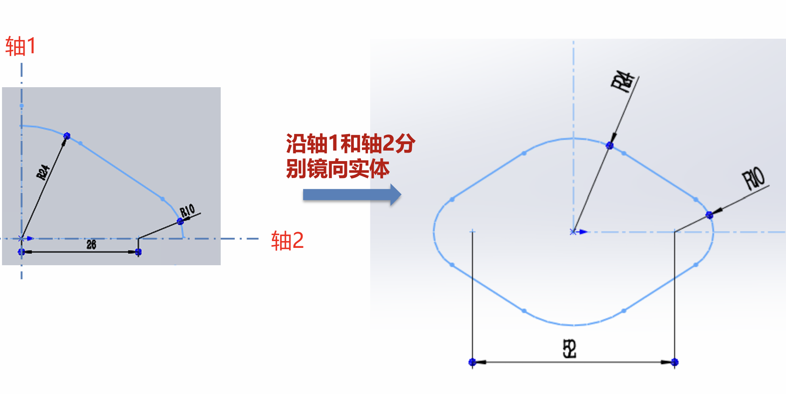
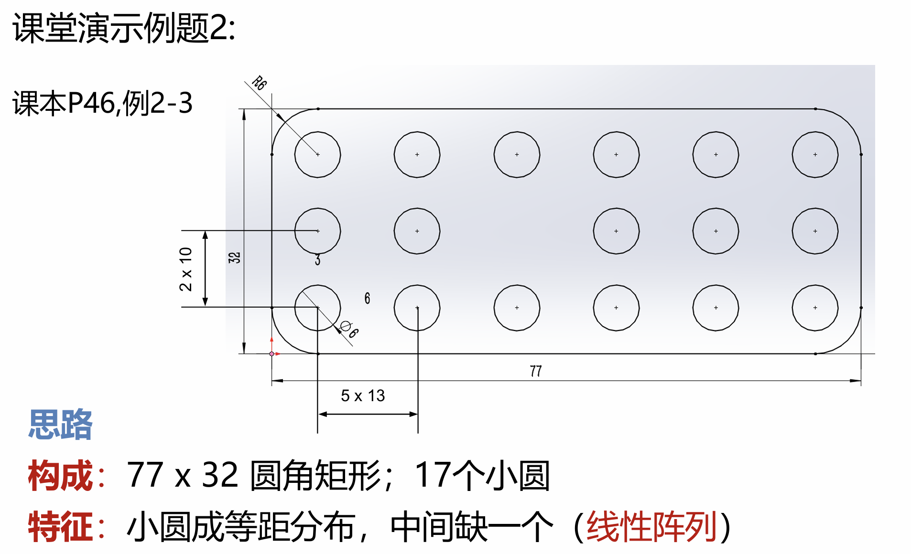
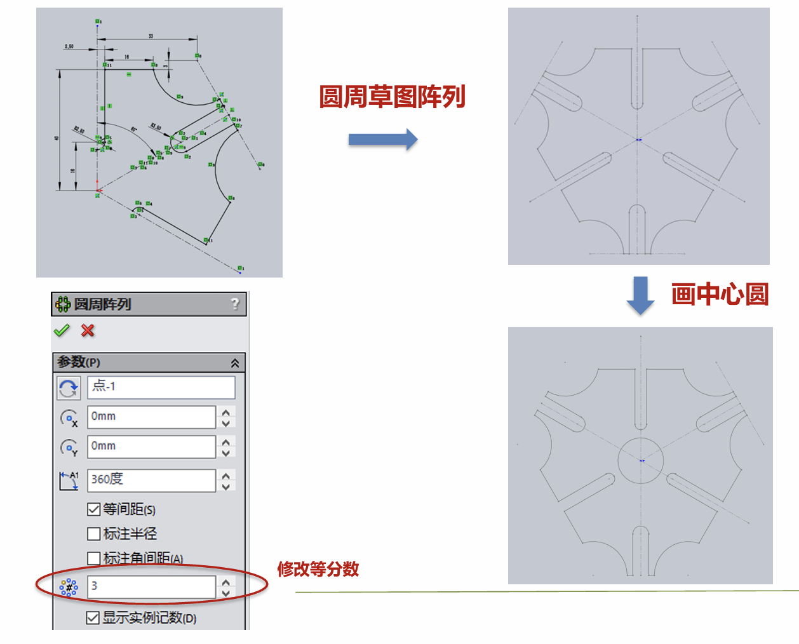

今天开始学习 SOLIDWORKS……

## 草图的绘制
***1. 2D草图***
- 绘制步骤
    1. 选择基准面
    2. 大致绘制草图基本形状
    3. 添加**几何关系**、标注**尺寸**

- “定义”问题
    1. 欠定义：草图中某实体还可以在某个方向上移动或者旋转
    2. 完全定义：草图有唯一、准确的描述
    3. 过定义：存在定义冲突

- 课堂范例（草图工具的运用）
    1. 镜像
        1. 先绘制轴线
        2. 镜像实体
        

    2. 阵列
        1. 线性阵列
        
        - 可选择沿两个坐标轴方向排布
        - 可以选择跳过某个元素

        2. 圆周阵列
        
        - 可选择沿两个坐标轴方向排布
        - 可以选择跳过某个元素
        - 
***2. 3D草图***
- 在“草图绘制”的下拉菜单中选择“3D草图”
- 按 **Tab** 键切换坐标面

---
> 附：SOLIDWORKS快捷操作大全

### 一、 核心“神级”操作（必学！）

这三个操作是 SOLIDWORKS 提升效率的灵魂，能大幅减少鼠标移动距离：

1. **`S` 键快捷菜单 (Shortcut Menu)**
   - **操作**：在任何工作状态下，直接按键盘上的 **`S`** 键。
   - **效果**：鼠标指针旁会立刻弹出一个**上下文相关的快捷菜单**。
     - 在**草图**中按 `S`：弹出直线、圆、剪裁、智能尺寸等草图工具。
     - 在**特征**中按 `S`：弹出拉伸、切除、圆角、抽壳等特征工具。
     - 在**工程图**中按 `S`：弹出标注、中心线、剖面线等工具。
   - *注：无需再去顶部的 CommandManager（命令管理器）里找图标！*

2. **鼠标手势 (Mouse Gestures)**
   - **操作**：**按住鼠标右键并拖动**。
   - **效果**：会弹出一个轮盘菜单（可自定义设置为2/4/8个快捷工具）。
   - **推荐配置（8手势）**：智能尺寸、拉伸凸台、拉伸切除、圆角、倒角、重建模型、正视于、上一视图。只需右键一划即可完成常用命令。

3. **确认角 (Confirmation Corner)**
   - **位置**：绘图区右上角的图标集合。
   - **效果**：在绘制草图或创建特征时，直接在右上角点击 **“✔” (确认)** 或 **“✖” (取消)**，不需要把鼠标大老远移回左侧属性管理器去点确认。

---

### 二、 视图控制快捷键（告别繁琐的视角切换）

熟练掌握视图切换，能让你在三维空间中不迷失方向：

| 快捷键 | 功能说明 | 备注 |
| :--- | :--- | :--- |
| **`空格键`** | **视图定向** | 弹出视图选择器（玻璃立方体），可快速切换标准视图或保存当前视图。 |
| **`Ctrl + 8`** | **正视于 (Normal To)** | **最常用！** 将当前选中的面或草图基准面正对屏幕（垂直视角）。 |
| **`Ctrl + 1~7`** | 标准视图 | 1前视、2后视、3左视、4右视、5上视、6下视、7等轴测。 |
| **`F`** | 缩放以适合屏幕 | 模型跑出视野或缩得太小时，按一下 `F` 瞬间全屏居中。 |
| **`Z` / `Shift + Z`** | 缩小 / 放大 | 以鼠标光标为中心进行缩放。 |
| **`Shift + 方向键`** | 旋转模型 | 上下左右键可以按固定角度旋转模型。 |
| **`Ctrl + B`** | 重建模型 (Rebuild) | 相当于刷新，解决修改尺寸后模型未更新或报错的问题。 |

**🖱️ 鼠标视图控制：**
- **按住中键（滚轮）拖动**：旋转模型。
- **`Ctrl` + 按住中键拖动**：平移模型。
- **`Shift` + 按住中键拖动**：缩放模型。
- **滚动滚轮**：缩放（*建议在“工具>选项>视图”中勾选“使屏幕缩放以光标为中心”，体验极佳*）。

---

### 三、 草图绘制与特征快捷键

SOLIDWORKS 默认没有给所有草图工具分配字母键，但你可以通过 **“工具 > 自定义 > 键盘”** 将高频命令绑定到单个字母上。以下是业界最流行的自定义/默认快捷键方案：

| 按键 | 推荐绑定功能 | 说明 |
| :--- | :--- | :--- |
| **`L`** | 直线 (Line) | 默认支持，画直线极快。 |
| **`C`** | 圆 (Circle) | 默认圆心圆。 |
| **`R`** | 矩形 (Rectangle) | 默认中心矩形或边角矩形。 |
| **`A`** | 圆弧 (Arc) | 圆心起点终点圆弧。 |
| **`D`** | 智能尺寸 (Smart Dimension) | **强烈推荐自定义为D**，标注尺寸必备。 |
| **`T`** | 剪裁实体 (Trim) | 推荐使用“强力剪裁”，划线即可剪裁。 |
| **`O`** | 偏移实体 (Offset) | 快速生成等距轮廓。 |
| **`M`** | 构造几何线 | 将实线切换为中心线/构造线（或自定义为构造线工具）。 |

**💡 草图隐藏技巧：**
- **`Tab` 键**：隐藏草图（将鼠标悬停在草图上按 `Tab`）。
- **`Shift + Tab`**：显示被隐藏的草图。
- **强制水平/垂直**：在绘制直线时，按住 `Shift` 键拖动，可以强制画出绝对水平或垂直的线。

---

### 四、 选择与过滤快捷键

当模型非常复杂（如包含大量特征的零件或复杂曲面），鼠标很难点中想要的边或面时，使用**选择过滤器**：

| 快捷键 | 功能 |
| :--- | :--- |
| **`X`** | 仅选择**边线** (Edge) |
| **`V`** | 仅选择**面** (Face) |
| **`E`** | 仅选择**顶点** (Vertex) |
| **`F5`** | 调出/隐藏“过滤器工具栏”（可以在这里锁定更多复杂过滤条件） |
| **`Ctrl` + 左键** | 追加选择（多选） |
| **`Shift` + 左键** | 连续选择（在树状图中） |
| **`Esc`** | 取消所有选择 / 退出当前命令 |

---

### 五、 进阶效率设置建议（磨刀不误砍柴工）

1. **开启“以光标为中心缩放”**
   - 路径：`工具` > `选项` > `系统选项` > `视图` > 勾选 **“使屏幕缩放以光标为中心”**。
   - *效果：鼠标指在哪里，滚轮就放大哪里，无需反复平移视图。*

2. **自定义鼠标手势**
   - 路径：`工具` > `自定义` > `鼠标手势`。
   - *建议设置为“8个手势”，把最常用的“拉伸切除”、“圆角”、“智能尺寸”、“正视于”放进去。*

